# BookAService
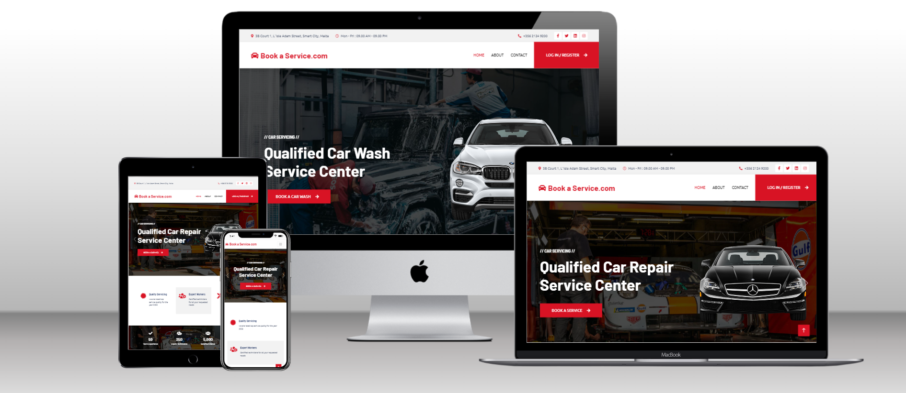

BookAService is a website designed for business and customers to register. While Business can share there available services and customers can book services that they need.

Unregistered users can view the index, about and contact pages to learn about the service. Users can sign up for the site from the registration form, and instantly be able to book or create there services.

Registered businesses can approve or cancel orders sent in the dashboard. Settings can be changed if need be and they can also add or remove services as needed.

Registered customers can book orders and also add special notes. Settings can be changed if need be. They also have to register their car details while logged in so the businesses can also confirm that they can work on that vehicle
It up to the business to call the customer to approve his booking and change the status of the job.


The live site can be found here: [BookAService](https://bookaservice-32a4c779d8fe.herokuapp.com/)

# Table of Contents
- [User Experience]()
- [Features]()
  - [General]()
- [Design]()
- [Technologies Used]()
- [Testing](TESTING.md)
- [Deployment]()
- [Credits]()

# User Experience

### User Stories

The user stories used as part of the planning for the website have been consolidated here.

- As an unregistered user I can view the website home, about and contact pages
- As an unregistered user I can register to be either as a business or a customer
- As a customer user I can change my settings of my account and delete it while logged in
- As a customer user I can register,remove and change details of any car while logged in
- As a customer user I can book from the dashboard page with any registered business while logged in
- As a customer user I can view the status in the dashboard of all bookings while logged in
- As a customer user I can log out of the account any time while logged in
- As a business user I can change my settings of my account and delete it while logged in
- As a business user I can change my services, update or delete them while logged in
- As a business user I can view all requests from the dashboard and change the actons as needed it while logged in
- As a business user I can view all completed requests from the dashboard while logged in
- As a business user I can log out of the account any time while logged in


# Features
## General
### Navigation Bar

<details>
<summary>Navbar</summary>


</details>

The navigation bar is featured across all pages.

For unregistered or logged-out users of the site, the navbar displays links to "Log in / Register", "About" and "Contact", with the "Log in / Register" link opening a new page when clicked on, listing the options of registration or login.There is also social media links, adress of website owner, opening hours and contact number.

For registered users of the site, the respective tabs show with the options needed to operate there account

The navbar is a free to use bootstrap5 from [themewagon.com](https://themewagon.com/themes/free-html5-bootstrap-5-business-website-template-carserv/)

### Footer

<details>
<summary>Footer</summary>


</details>

The footer is featured across all pages.

The footer features a standard address information with social media links next to the opening hours. Then there are the services showing a few service what can be found and a newsletter that is currently on comming soon. At the bottom there are copyrights tags on the left and on the right there are the Home button FAQ`s and a button to go to the top of the page quickly.

### Home Page

<details>
<summary>Home Page Unregistered</summary>

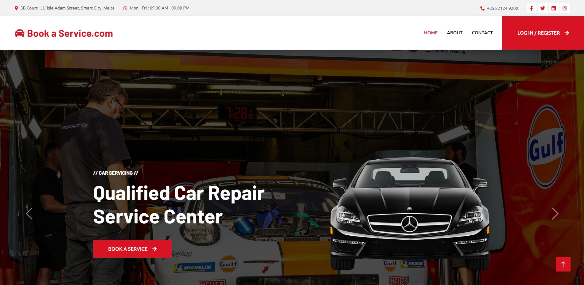
</details>

<details>
<summary>Home Page Logged In as customer</summary>

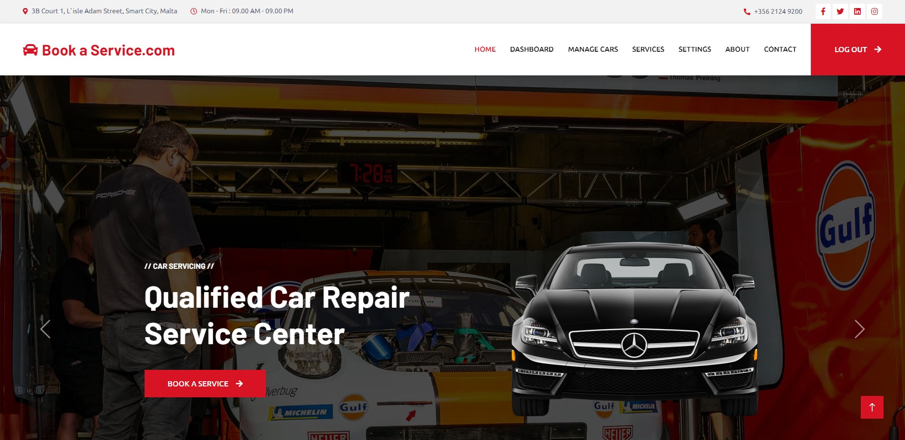
</details>

<details>
<summary>Home Page Logged In as business</summary>

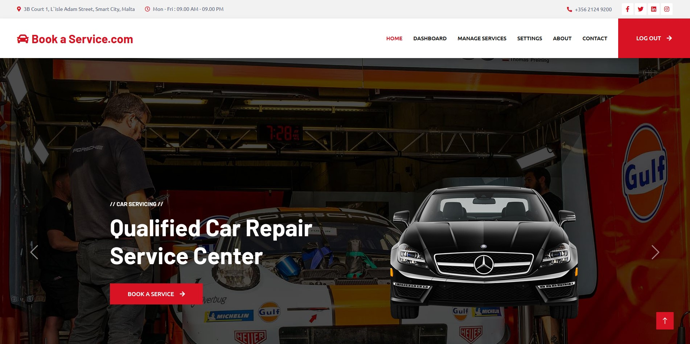
</details>

The Home page has three states depending on the user.

For all users, the home page displays a spinning services ad, "Log in / Register" in the top right section. While scrolling you can see the company’s achievements, then some of the company’s workers and finally a few reviews from users.

For logged in accounts the top nav bar will display new tabs to use the websites function. These will change with what type of user you are logged in as. User only have one login page the back end will automatically assign the correct tabs to that user to view.


### About Page

<details>
<summary>About Page</summary>


</details>

The about page is available for users who are not registered or who are not logged in through a link in the navbar. 

The primary purpose is to act as marketing for the site for users and business who are learning about the site. This can intise them to register and increase the popularity of the site to see what they can offer or how to increase there business.
### Contact Page

<details>
<summary>Contact Page</summary>


</details>

The contact page is available to all users through a link in the navbar for users who are not logged in or a link in the footer for those who are It features a simple form that requires the name, email and message from the user. It sends the message to the site owner and provides the user with feedback by displaying "Message sent."

### Registration Page

<details>
<summary>Registration Page</summary>


</details>

The registration page is accessible through all areas of the site this will guide them to register and inform them in which area they should register. This ismple design make it easy to figur out and reduces the need of extra pages.

### Login Page

<details>
<summary>Login Page</summary>


</details>

The login page is accessible through the same page where the registration page is. This will lead them to the sign in page. This design also helps the Users and businesses that registered to loggin from one simple page. The bakend service will identify
what the email is under and display the correct tabs and feautres they need.

### Profile

<details>
<summary>Profile</summary>


</details>
The Dashbaord will also change from customers to business. This page will show bookings that were sent to the business. From here they can accept or cancel requests, set requests to done once ready and see a history of completed requests.
While the customers will have a list of what books they have with the propper status and the ability to book other services.


### Settings

<details>
<summary>Settings</summary>


</details>

The settings page is where all users are able to change there details any time they need to and update the password for there accounts. This page will also adapt to the users details from there initial registration.


# Design

The concept for bookaservice was a profersional site for people to be able to find and offer services. The clean and simple design of the page is structured to guide all users to there desired need as easy as possable.

## CRUD Functionality

While trying to satisfty most possable needs to cater all the needs from both customers and businesses the avalabilty to view edit create and delete is possable thru out most of the nessasery infomration to make sure its possable to keep up to date with
minimal need to redo or re-create services and ussers.

## Colour


A red, black white colour palette was used for this project based on the template that was used for this project. The main background colour is a white with a hint of black text to give a clean appearance and easy on the eye`s. Buttons have different colors to infor the user that these are special buttons that can offer a type of function depending on the need.


## Wireframes

Wireframes were created in Balsamiq. They were used for initial planning of template layouts.

<details>
<summary>Home Wireframe</summary>

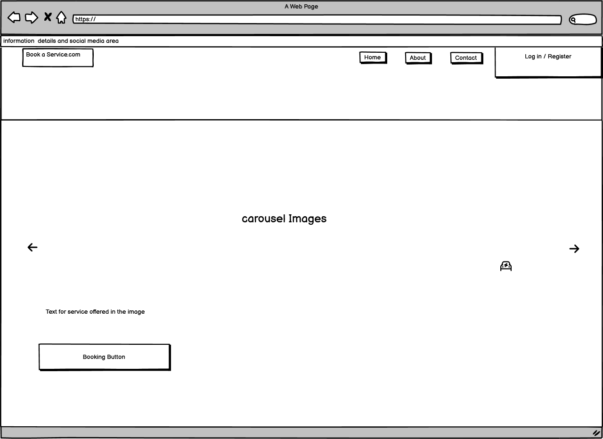
</details>

<details>
<summary>About Wireframe</summary>

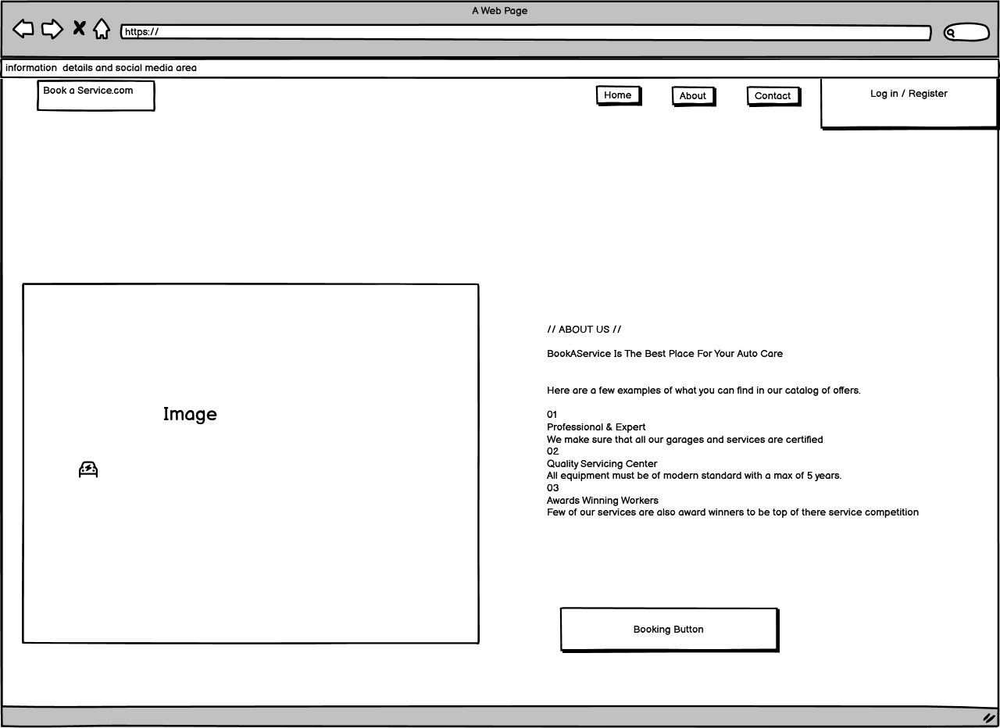
</details>

<details>
<summary>Contact Wireframe</summary>

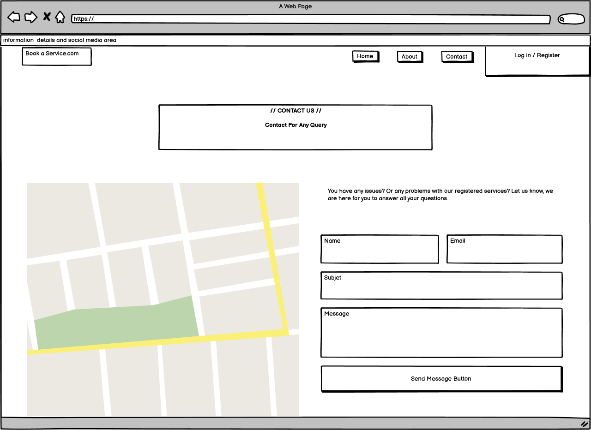
</details>

<details>
<summary>All user settings Wireframe</summary>

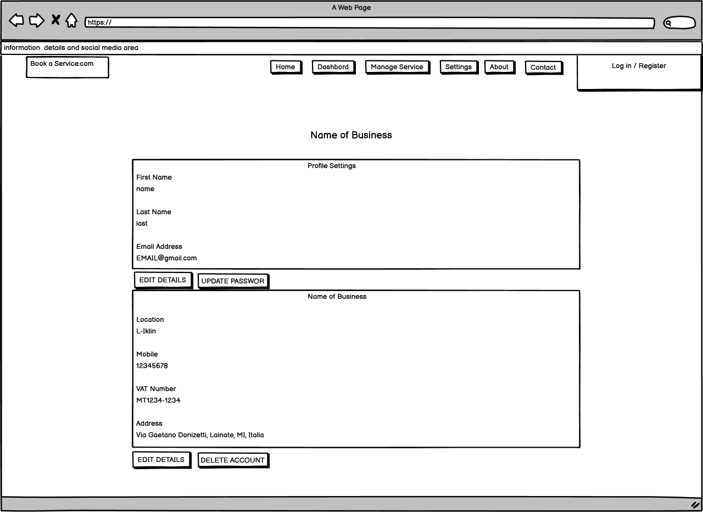
</details>

<details>
<summary>Customer Dashbord Wireframe</summary>

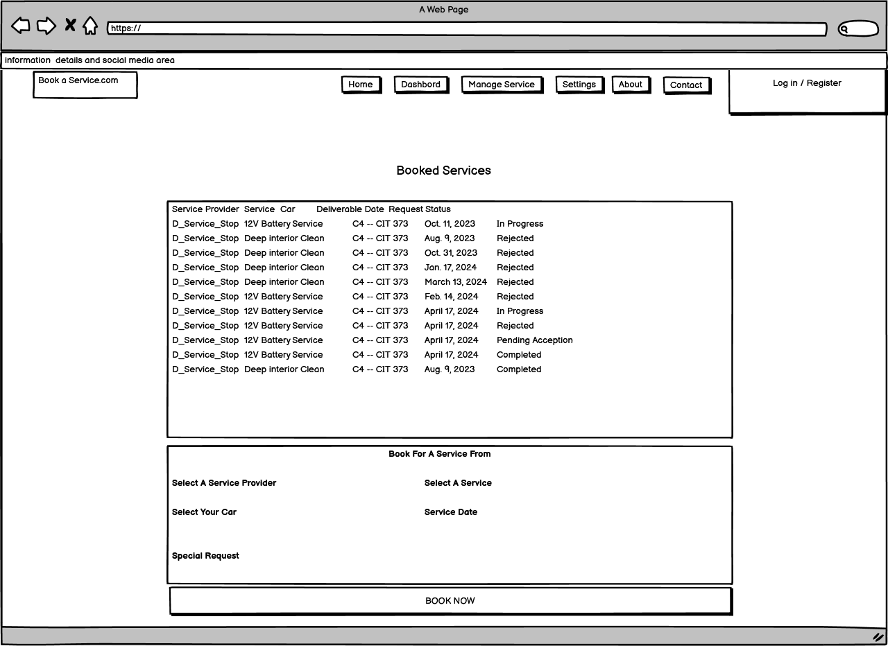
</details>

<details>
<summary>Customer Manage Cars Wireframe</summary>

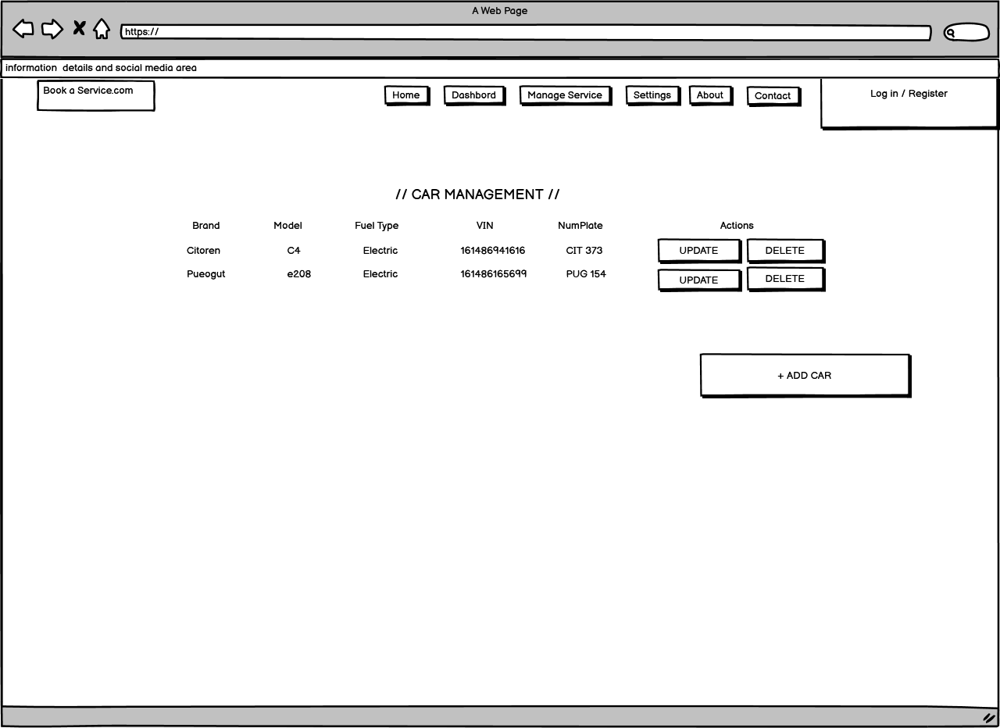
</details>

<details>
<summary>Business Manage Services Wireframe</summary>

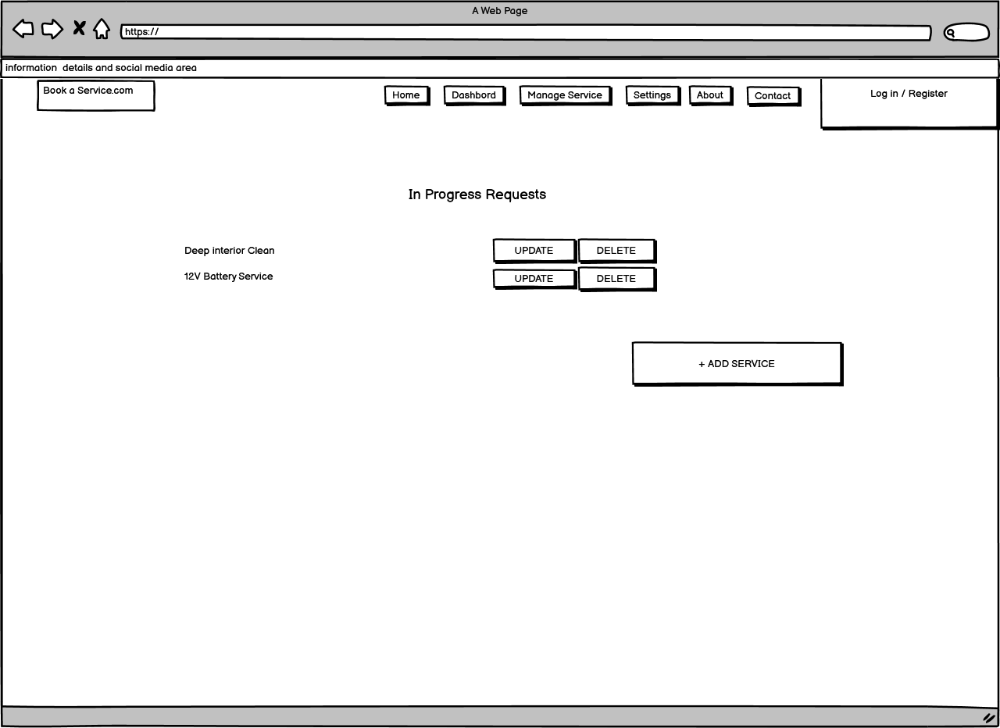
</details>

<details>
<summary>Business Logged in DashBoard Wireframe</summary>

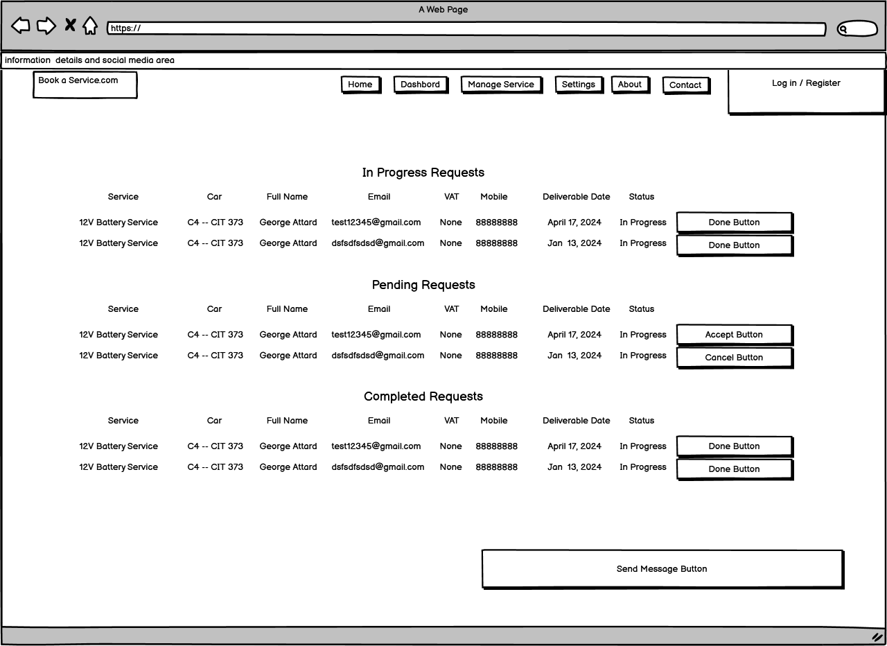
</details>


## Agile Methodology

[GitHub Projects Page]()

Jira system was used to to create an agaile system. Ideas where first listed down and separated to hold estimated time, details of the ticket, issues and organaised by which needed to be done first.


## Entity Relationship Diagram

The below Entity Relationship Diagram was created on [diagrams.net](https://www.diagrams.net/). It illustrates the relationships between the 6 models present in the project: bookservice, service, Business, Car, Customer and User
<details>
<summary>ERD</summary>

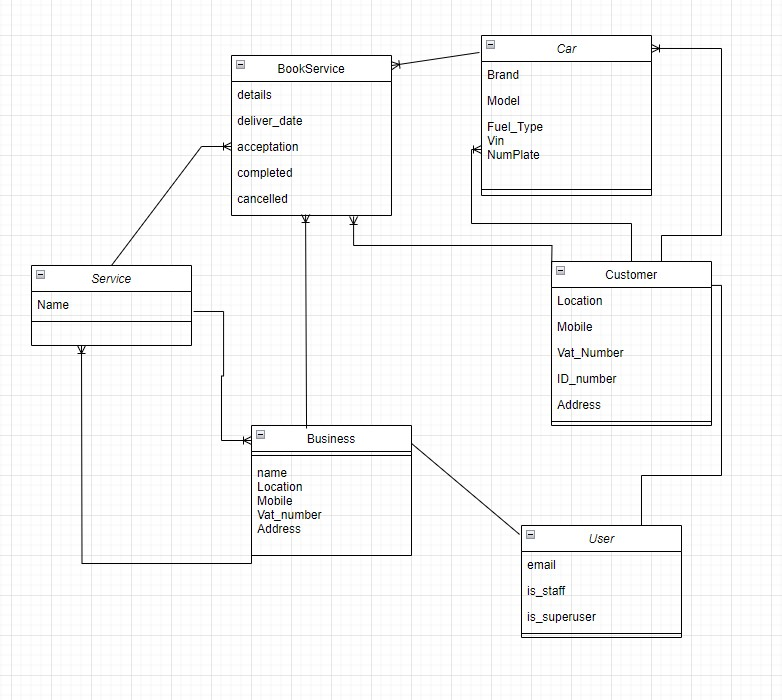
</details>


# Technologies Used

- [HTML5](https://en.wikipedia.org/wiki/HTML5): mark-up language.
- [CSS3](https://en.wikipedia.org/wiki/CSS): styling.
- [JavaScript](https://www.javascript.com/): programming language.
- [Python 3](https://www.python.org/): programming language.
- [Django 3.2](https://www.djangoproject.com/)
  - [Django Crispy Forms](https://pypi.org/project/django-crispy-forms/): for forms.
  - [Crispy Bootstrap5](https://pypi.org/project/crispy-bootstrap5/): bootstrap5 template pack for crispy forms.
  - [Django Forms Dynamic](https://github.com/dabapps/django-forms-dynamic): for the dynamic form using HTMX.
  - [Django Widget Tweaks](https://pypi.org/project/django-widget-tweaks/): for the dynamic form.
  - [Coverage](https://github.com/nedbat/coveragepy/tree/6.5.0): for measuring code coverage of Python tests.
- [HTMX](https://htmx.org/): UI.
- [Bootstrap](https://getbootstrap.com/): styling.
- [GIT](https://git-scm.com/): for version control.
- [GitHub](https://github.com/): for host repository.
- [Gitpod](https://www.gitpod.io/): online IDE.
- [PyCharm](https://www.jetbrains.com/pycharm/): IDE.
- [Heroku](https://)
- [Google Fonts](https://fonts.google.com/): to import fonts.
- [Font Awesome](https://fontawesome.com/): to import icons.
- [Balsamiq](https://balsamiq.com/): to create wireframes.
- [Diagrams.net](https://www.diagrams.net/): for Entity Relationship Diagram.

# Testing

Bookaservice Testing is performed manually, and automated using Selenium IDE exported to PyTest code.

### Validation of HTML, CSS, JS, and Python Code
Validation tools used are [Nu HTML Checker](https://validator.w3.org/nu/), [Jigsaw](https://jigsaw.w3.org/css-validator/), [JSHint](https://jshint.com/), [PEP8 codeInst](https://pep8ci.herokuapp.com/#), [autopep8 (locally, CLI)](https://pypi.org/project/autopep8/), and [Python Syntax Checker](https://extendsclass.com/python-tester.html).

### Manual Behaviour Driven Development Testing
Running the manual tasks validate the Use Case, and in turn the User Story. A test will either Pass or Fail.

| User Story                                                                                                                                                                                                   | Use Case                                                                                                                                                                                                                                                                      | Pass / Fail |
|--------------------------------------------------------------------------------------------------------------------------------------------------------------------------------------------------------------|-------------------------------------------------------------------------------------------------------------------------------------------------------------------------------------------------------------------------------------------------------------------------------|-------------|


### Automated Behaviour Driven Development Testing using Selenium IDE and PyTest
Selenium IDE runs automated, and scripted tests when configured. In this case the Selenium IDE recording function is used to create the scripts, the scripts are exported to PyTest code, and then run to validate the test cases.

To prepare for the tests:
* Install pytest, selenium and the correct webdriver (ChromeDriver)
	* pip3 install pytest
	* pip3 install selenium
	* http://chromedriver.chromium.org/downloads
		* Unzip and copy 'chromedriver 2' to the virtual Python/bin directory. Rename it to 'chromedriver'.
		* Execute chromedriver in the terminal to ensure the correct version is running; it has to match the version in "About Google Chrome". If using other browsers, other webdrivers must be installed. Don't do "pip3 install ChromeDriver" as it's likely to install an older version which means that the tests won't run as Chrome can't be controlled.

# Deployment
## Steps to deploy site using Heroku:
- Assuming gunicorn, dj_database_url and psycopg2 have been installed
- On the Heroku dashboard, select "New" and click "Create new app"
  - Create a unique app name - this will be added to allowed hosts in the project settings
  - Select your region
  - Click "Create app"
- Go to the Resources tab:
  - Search for "postgres" in the add-ons search bar and select "Heroku Postgres"
  - Click "Submit Order Form"
- Go to the settings tab:
  - Scroll down to the config vars section and select "Reveal Config Vars"
  - DATABASE_URL will be set after adding Heroku Postgres - this will be copied to the project
  - Add a new config var for SECRET_KEY - create your own or use a django secret key generator
  - Add a new config var for DISABLE_COLLECTSTATIC, with the value 1 - this will be removed before deployment
- In your project, for your environment variables:
  - Create a new env.py file in the top level directory
  - In env.py:
    - Import os
    - Add 'os.environ["DATABASE_URL"] = "Paste the DATABASE_URL from the Heroku app here"'
    - Add 'os.environ["SECRET_KEY"] = "Paste your new secret key here"'
  ```
  import os

  os.environ['DATABASE_URL'] = 'postgres://exampledatabaseurl'
  os.environ['SECRET_KEY'] = 'examplesecretkey'
  os.environ['CLOUDINARY_URL'] = 'cloudinary://examplecloudinaryurl'
  ```
  - If not already present, create a .gitignore file and add env.py to it

- In your project, in settings.py:
  - Import os
  - Import dj_database_url
  - if os.path.isfile('env.py'):
	import env
  ```
  import os
  import dj_database_url
  if os.path.isfile('env.py'):
      import env
  ```
  - Replace the insecure secret key with "SECRET_KEY = os.environ.get('SECRET_KEY')"
  ```
  SECRET_KEY = os.environ.get('SECRET_KEY')
  ```
  - Link new database by commenting out old DATABASES section and adding:
	DATABASES = {
			'default': dj_database_url.parse(os.environ.get('DATABASE_URL'))
			}
  ```
  DATABASES = {
        'default': dj_database_url.parse(os.environ.get('DATABASE_URL'))
    }
  ```
  - Add Heroku to the allowed hosts: "ALLOWED_HOSTS = ['the_app_name_from_heroku.herokuapp.com']
  ```
  ALLOWED_HOSTS = ['example-heroku-app-name.herokuapp.com', 'localhost']
  ```
  ```
  ...
  'whitenoise.middleware.WhiteNoiseMiddleware',
  ...
  ```
  ```
    STATIC_URL = '/static/'
	STATICFILES_STORAGE = 'cloudinary_storage.storage.StaticHashedCloudinaryStorage'
	STATICFILES_DIRS = [os.path.join(BASE_DIR, 'static')]
	STATIC_ROOT = os.path.join(BASE_DIR, 'staticfiles')

	MEDIA_URL = '/media/'
	DEFAULT_FILE_STORAGE = 'cloudinary_storage.storage.MediaCloudinaryStorage'
  ```
  - Run 'python3 manage.py collectstatic' to collect static files
- In your project:
  - Create a Procfile in the top level directory and add 'web: gunicorn project_name.wsgi' to tell 
  ```
  web: gunicorn project_name.wsgi
  ```
  - Create a requirements file with 'pip3 freeze --local > requirements.txt' for Heroku to install required packages
  ```
  pip3 freeze --local > requirements.txt
  ```
  - Make migrations with 'python3 manage.py migrate'
  ```
  python3 manage.py migrate
  ```
  - Commit and push to GitHub
- Prior to final deployment:
  - Set DEBUG = False in project settings.py
  - Remove DISABLE_COLLECTSTATIC config var from Heroku
- Go to the Deploy tab:
  - Select GitHub and confirm connection to GitHub account
  - Search for the repository and click "Connect"
  - Scroll down to the deploy options
  - Select automatic deploys if you would like automatic deployment with each new push to the GitHub repository
  - In manual deploy, select which branch to deploy and click "Deploy Branch"
  - Heroku will start building the app
- The link to the app can be found at the top of the page by clicking "Open app"

The live site can be found here: [BookeAservice.com](https://bookaservice-32a4c779d8fe.herokuapp.com/)


## Steps to clone site:
- In the GitHub repository, click the "Code" button.
- Select "HTTPS" and copy the URL.
- Open Git Bash and navigate to the repository where you would like to locate the cloned repository.
- Type "git clone" followed by the copied URL.
- Press enter to create the clone.
- Install required packages with the command "pip3 install -r requirements.txt"


## Acknowledgement
I'd like to thank my mentor, Brian Macharia, for providing very good advice, tips and feedback, as well as excellent resources that I need in this project.